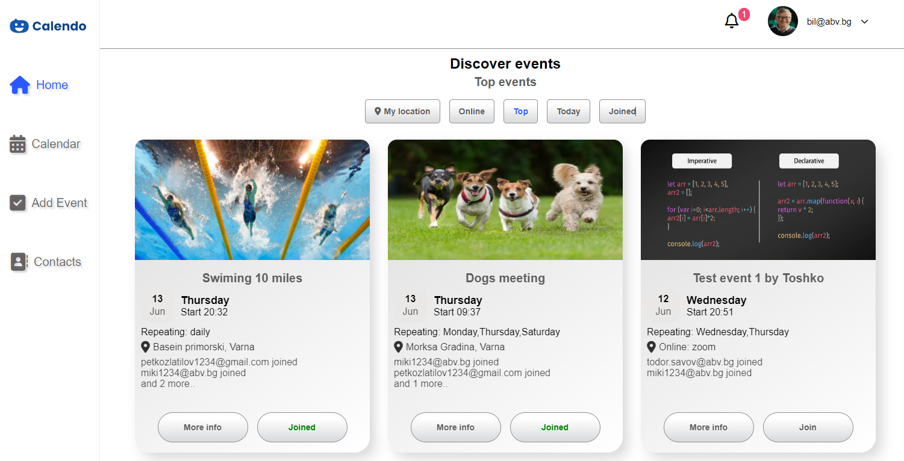
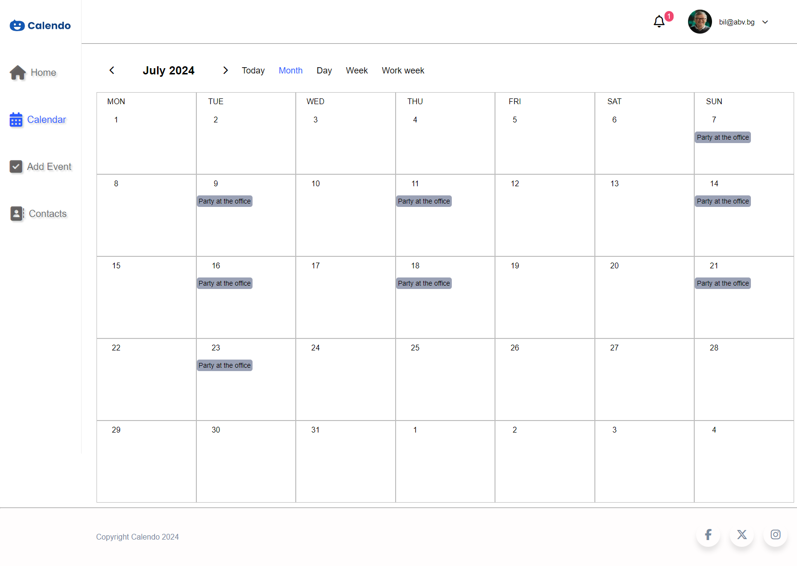
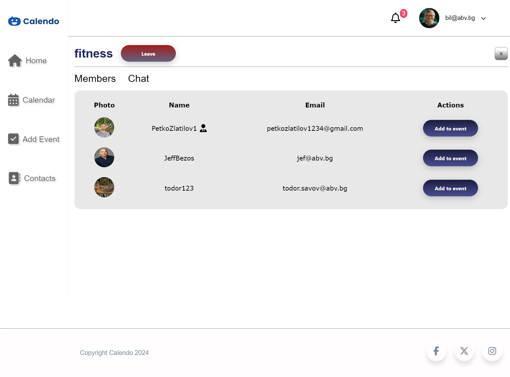
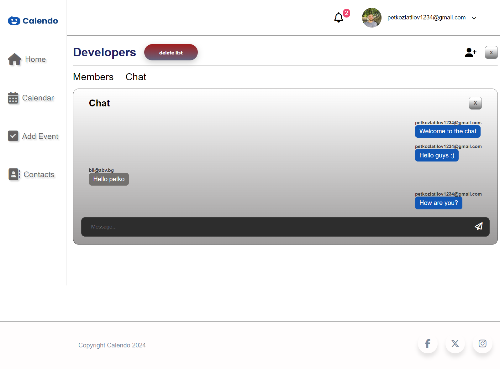
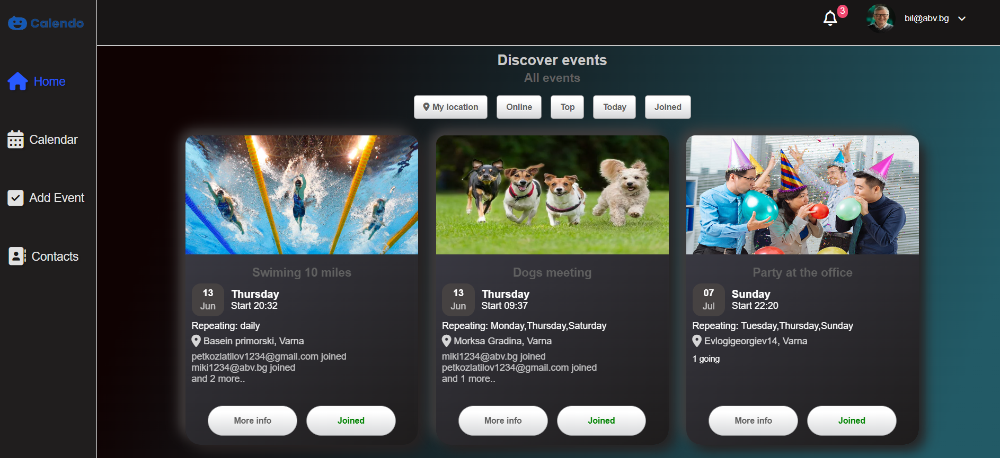
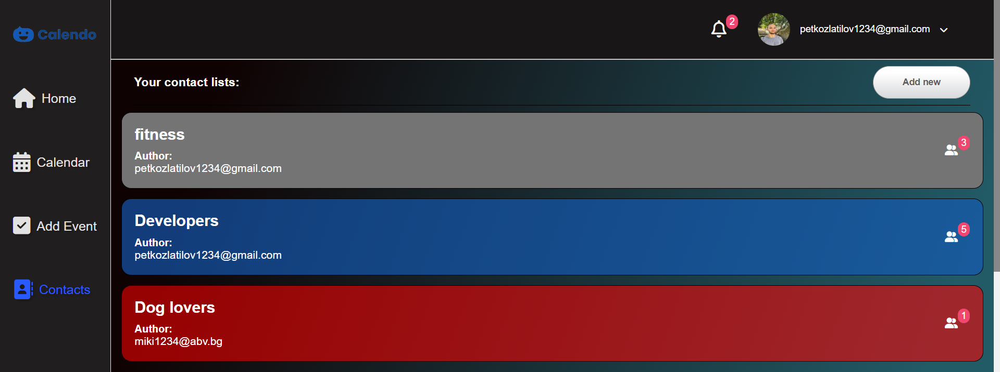

# Event Calendar Website


## About the Project

This project is an Event Calendar Website, designed to help you manage your events efficiently. It's built using React for the frontend and Firebase for the backend, providing a robust and scalable solution for event management. The website provides a clear and intuitive interface for tracking and organizing events, making it easy to keep track of your schedule. The app is fully responsive, ensuring a seamless user experience on all devices.


## Features

Some of the standout features of the website include:

- **User Profiles**: Users have their own profiles and can modify their information.
- **Event Search**: Users can search for events by location, and check online events, top matches, and events happening today.
- **Join Events**: Users can join other users' events.
- **Event Adding**: Easily add new events to your calendar with just a few clicks.
- **Contact Lists**: Users can create contact lists and add users from these lists to their events.
- **Chat**: Users can chat with other users in their contact lists.
- **Event Calendar**: Users can see all the events they have joined in the calendar, complete with day and hour details. The calendar has different views like month, day, week, and work week.
- **Settings**: The app provides different types of settings for customization, including the option to switch to a dark theme.


Explore the website to discover more features!

## Technologies Used

- **Frontend**: 
  - React
  - JavaScript
  - HTML
  - CSS

- **Backend**: 
  - Firebase

- **APIs**:
  - OpenWeather API
  - Google Maps API

- **Additional Tools**:
  - ESLint (for code linting)
  - Git (for version control)

## Local Setup

To set up the project locally, follow these steps:

1. Clone the repository.
2. Install dependencies by running the following command in the project directory:
    ```
    npm install
    ```
3. Start the development server:
    ```
    npm run dev
    ```

Please note that you need to have Node.js and npm installed on your machine to set up and run the project locally.

## Contributing

Contributions are welcome! If you find any issues or have suggestions for improvements, please open an issue or submit a pull request

For a more direct line of communication, we have a feedback section in the website settings. You can use this to send us a message about any issues you encounter or suggestions you have.


## Contact

Petko Petkov - petkozlatilov1234@gmail.com

Todor Savov - todor.savov.a58@learn.telerikacademy.com


## Scheme of the database
```
{
  "contactLists": {
    "-NzmxM_ygWi2d6ak8WNE": {
      "color": "#dddddd",
      "contacts": ["nasko@abv.bg", "miki1234@abv.bg", "miki@abv.bg"],
      "messages": [
        {
          "message": "Welcome to the chat",
          "name": "todor.savov@abv.bg"
        }
      ],
      "name": "Personal",
      "owner": "todor.savov@abv.bg"
    }
  },
  "events": {
    "-NzyHqzsBsrYqmo3G2Z8": {
      "author": "petkozlatilov1234@gmail.com",
      "canInvite": true,
      "description": "aw",
      "endDate": "2024-06-13",
      "endTime": "23:40",
      "id": "-NzyHqzsBsrYqmo3G2Z8",
      "invited": [
        "petkozlatilov1234@gmail.com",
        "miki1234@abv.bg",
        "bil@abv.bg"
      ],
      "location": {
        "city": "Varna",
        "country": "Bulgaria",
        "street": "Evlogigeorgiev14"
      },
      "locationType": "offline",
      "photo": "https://leekduck.com/assets/img/events/events-default.jpg",
      "repeat": {
        "schedule": "daily"
      },
      "startDate": "2024-06-11",
      "startTime": "21:38",
      "title": "test1",
      "visibility": "public"
    }
  },
  "users": {
    "PetkoZlatilov1": {
      "address": {
        "city": "Varna",
        "country": "Bulgaria",
        "street": "Evlogigeorgiev14"
      },
      "email": "petkozlatilov1234@gmail.com",
      "firstName": "Petko",
      "isBlocked": false,
      "lastName": "Petkov",
      "phone": "5555555555",
      "photo": "https://firebasestorage.googleapis.com/v0/b/event-calendar-c74a9.appspot.com/o/users%2Fpetkozlatilov1234%40gmail.com%2Fphoto?alt=media&token=f1b029d7-f692-43f2-8979-d251c0267613",
      "role": "admin",
      "username": "PetkoZlatilov1"
    }
  }
}
```
## Photos







